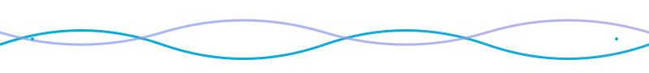

<!-- Custom animated banner (rendered from assets/header.svg) -->

 

 

<!-- ⚡ Live counters — these update in real time, on every single profile view -->

<!-- Cumulative profile views — auto-updated by the GitHub Actions visitor counter workflow -->
 <!-- VISITOR_COUNT_BADGE -->

<!-- Animated wave divider -->

## 💫 About Me

- 🔭 I'm currently working on **API development** and **optimizing proxy server routes**
- 👯 I'm looking to collaborate on **backend systems, server optimization, and open-source API projects**
- 🤝 I'm looking for help with **advanced proxy routing and scaling server architectures**
- 🌱 I'm currently learning **modern deployment patterns and advanced server-side configurations**
- 💬 Ask me about **VPS setups, RESTful APIs, proxy network routing, or digital text design**
- ⚡ Fun fact: I only write production-ready code because I already own the hosting!

 

## 🖥️ Peek Into My Terminal

<!-- Custom animated terminal (rendered from assets/terminal.svg) -->

 

## 📣 Join My Telegram Universe

 

> 🚀 **Updates** → [Channel](https://t.me/TomatoFist) &nbsp;•&nbsp; 💬 **Chat with the community** → [Group](https://t.me/Venom_chatting) &nbsp;•&nbsp; 👑 **Reach me directly** → [Owner](https://t.me/K_4ip)

 

## 🌐 Connect With Me

 

## ⚡ The Venom Stack

<!-- Custom animated skill bars (rendered from assets/tech-matrix.svg) -->

 

## 💻 Tech Stack

**Languages & Frameworks**

      

**Cloud & Hosting**

           

**Backend & Servers**

       

**Databases**

     

**Frontend & Tools**

      

**DevOps & Automation**

         

**Networking & Security**

    

**Data / ML**

    

**Design**

    

**Game Dev**

  

 

## 📊 GitHub Analytics

 

<!-- Profile summary cards — live GitHub analytics in one glance -->

  
  
  
  

 

 

## 🧊 3D Contribution Graph

<!-- Generated every day by the "Generate 3D Contribution Graph" workflow in .github/workflows/profile-3d.yml -->

 

## 🐍 Contribution Snake

<!--START_SECTION:snake-->

<!--END_SECTION:snake-->

 

## 😂 Random Dev Joke

 

## ✍️ Random Dev Quote

 

## 🎮 Mini Game — Play Directly in the README

**Try to catch me!** 👇 Click to open an interactive 2048-style game hosted on GitHub Pages:

 

## 💰 Support My Work

---

<b>⚙️ Profile Automation — how everything stays live</b>

This profile is powered by three GitHub Actions workflows that keep every widget up to date automatically:

| Workflow | What it does | Runs |
|---|---|---|
| [`visitor-counter.yml`](.github/workflows/visitor-counter.yml) | Pulls real GitHub traffic data and updates the cumulative **Profile Views** badge (the one marked `VISITOR_COUNT_BADGE`) | Every 6 hours + manual |
| [`profile-3d.yml`](.github/workflows/profile-3d.yml) | Renders the **3D contribution graph** with the [yoshi389111/github-profile-3d-contrib](https://github.com/yoshi389111/github-profile-3d-contrib) action | Every day + manual |
| [`snake.yml`](.github/workflows/snake.yml) | Regenerates the animated **contribution snake** and pushes it to the `output` branch | Every 6 hours + manual |

**The live visitor counter** (top of this page) is rendered by [visitor-badge.laobi.icu](https://visitor-badge.laobi.icu) — it increments in real time on every single profile view, no workflow needed.

**The animated graphics** (banner, terminal, skill bars, wave divider) are custom SVG files in the [`assets/`](assets/) folder of this repo — fully self-hosted, so they never break and no third party is involved.

> 💡 The 3D graph image appears after the `Generate 3D Contribution Graph` workflow has run once — trigger it manually from the **Actions** tab, or wait for the daily schedule.

 

⚡ Built with production-ready code, because I already own the hosting.

