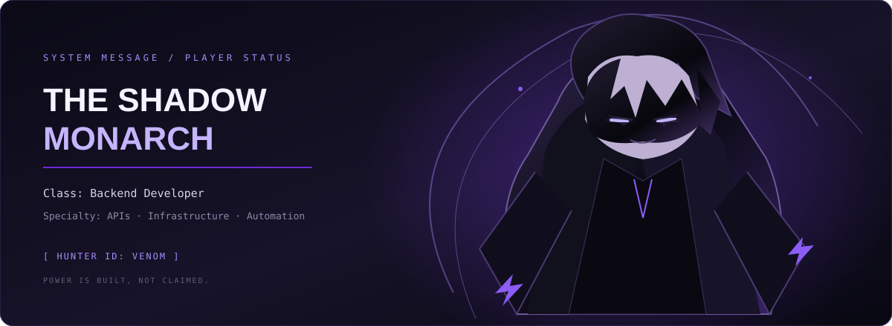

 

 <!-- VISITOR_COUNT_BADGE -->

## ⚔️ Hunter Profile — About Me

- 🔭 I'm currently working on **API development** and **optimizing proxy server routes**
- 👯 I'm looking to collaborate on **backend systems, server optimization, and open-source API projects**
- 🤝 I'm looking for help with **advanced proxy routing and scaling server architectures**
- 🌱 I'm currently learning **modern deployment patterns and advanced server-side configurations**
- 💬 Ask me about **VPS setups, RESTful APIs, proxy network routing, or digital text design**
- ⚡ Fun fact: I only write production-ready code because I already own the hosting!

 

## 🗡️ Featured Build — Featured Project

**[VenomMusic](https://github.com/venombolteop/VenomMusic)** · A Telegram music bot project with playback controls, interactive panels, and chat-focused UX.

[Explore all repositories →](https://github.com/venombolteop?tab=repositories)

 

## ▣ Hunter Console — Terminal

<!-- Custom animated terminal (rendered from assets/terminal.svg) -->

 

## ◈ Guild Network — Telegram

 

> 🚀 **Updates** → [Channel](https://t.me/TomatoFist) &nbsp;•&nbsp; 💬 **Chat with the community** → [Group](https://t.me/Venom_chatting) &nbsp;•&nbsp; 👑 **Reach me directly** → [Owner](https://t.me/K_4ip)

 

## ✦ Find Me — Connect

 

## ◇ Shadow System — The Venom Stack

<!-- Custom animated skill bars (rendered from assets/tech-matrix.svg) -->

 

## ⚙️ Arsenal — Tech Stack

**Languages & Frameworks**

      

**Cloud & Hosting**

           

**Backend & Servers**

       

**Databases**

     

**Frontend & Tools**

      

**DevOps & Automation**

         

**Networking & Security**

    

**Data / ML**

    

**Design**

    

**Game Dev**

  

 

## ◉ Hunter Status — GitHub Analytics

 

<!-- Profile summary cards — live GitHub analytics in one glance -->

  
  
  
  

 

 

## ◈ Awakening Metrics — GitHub Metrics

<!-- Rich metric card generated by the "GitHub Metrics" workflow — aggregates
     private + public contributions, languages & achievements. Never shows repo
     names or details, only numbers. -->

 

## ✧ Mana Core — 3D Contribution Graph

<!-- Generated every day by the "Generate 3D Contribution Graph" workflow in .github/workflows/profile-3d.yml -->

 

## ⟡ Shadow Trail — Contribution Snake

<!--START_SECTION:snake-->

<!--END_SECTION:snake-->

 

## ☾ Guild Tavern — Random Dev Joke

 

## ✦ Monarch's Doctrine — Random Dev Quote

 

## 🎮 Side Quest — Mini Game

**Try to catch me!** 👇 Click to open an interactive 2048-style game hosted on GitHub Pages:

 

## ♡ Support the Guild — Support My Work

---

<b>⚙️ Profile Automation — how everything stays live</b>

This profile uses GitHub Actions to refresh generated visualisations and repository traffic data:

| Workflow | What it does | Runs |
|---|---|---|
| [`visitor-counter.yml`](.github/workflows/visitor-counter.yml) | Pulls this repository's GitHub traffic data and updates the cumulative repository-view counter | Every 6 hours + manual |
| [`profile-3d.yml`](.github/workflows/profile-3d.yml) | Renders the **3D contribution graph** with the [yoshi389111/github-profile-3d-contrib](https://github.com/yoshi389111/github-profile-3d-contrib) action | Every day + manual |
| [`metrics.yml`](.github/workflows/metrics.yml) | Generates the **rich metrics card** (private + public contributions, languages, achievements, lines of code) with [lowlighter/metrics](https://github.com/lowlighter/metrics) — aggregates only, **never shows repo names** (the upstream achievements plugin is disabled until its retired Projects API query is fixed) | Every day + manual |
| [`snake.yml`](.github/workflows/snake.yml) | Regenerates the animated **contribution snake** and pushes it to the `output` branch | Every 6 hours + manual |

**The profile-view badge** is provided by [visitor-badge.laobi.icu](https://visitor-badge.laobi.icu). Like other external counters, its result can be affected by caching and image requests.

**The animated graphics** (banner, terminal, skill bars, wave divider) are custom SVG files in the [`assets/`](assets/) folder of this repo — fully self-hosted, so they never break and no third party is involved.

> 💡 The 3D graph image appears after the `Generate 3D Contribution Graph` workflow has run once — trigger it manually from the **Actions** tab, or wait for the daily schedule.

<b>🔐 Want private contributions in the metrics card? (one-time setup)</b>

The default `GITHUB_TOKEN` can only see **public** data. To include your **private** contributions (still no repo names or details — just numbers):

1. Go to **github.com → Settings → Developer settings → Personal access tokens → Tokens (classic)**
2. **Generate new token (classic)** → tick the `repo` scope → **Generate** → copy the token
3. Back on this repo: **Settings → Secrets and variables → Actions → New repository secret**
   - **Name:** `METRICS_TOKEN`
   - **Value:** paste the token
4. Run the **GitHub Metrics** workflow from the **Actions** tab once

The token is stored encrypted by GitHub and never appears in the README. If you skip this step, the metrics card simply renders with public data only.

> 🔒 Tip: the classic `repo`-scoped token is the standard for this. For maximum paranoia, use a **fine-grained** token limited to read access on your private repos and store it the same way.

 

⚡ Built with production-ready code, because I already own the hosting.

